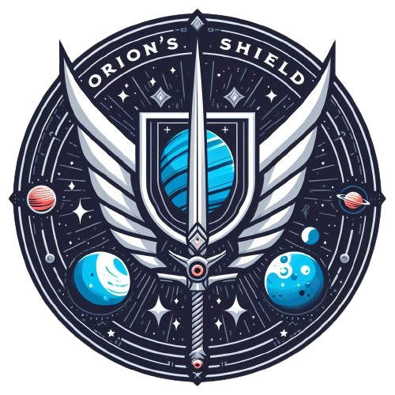
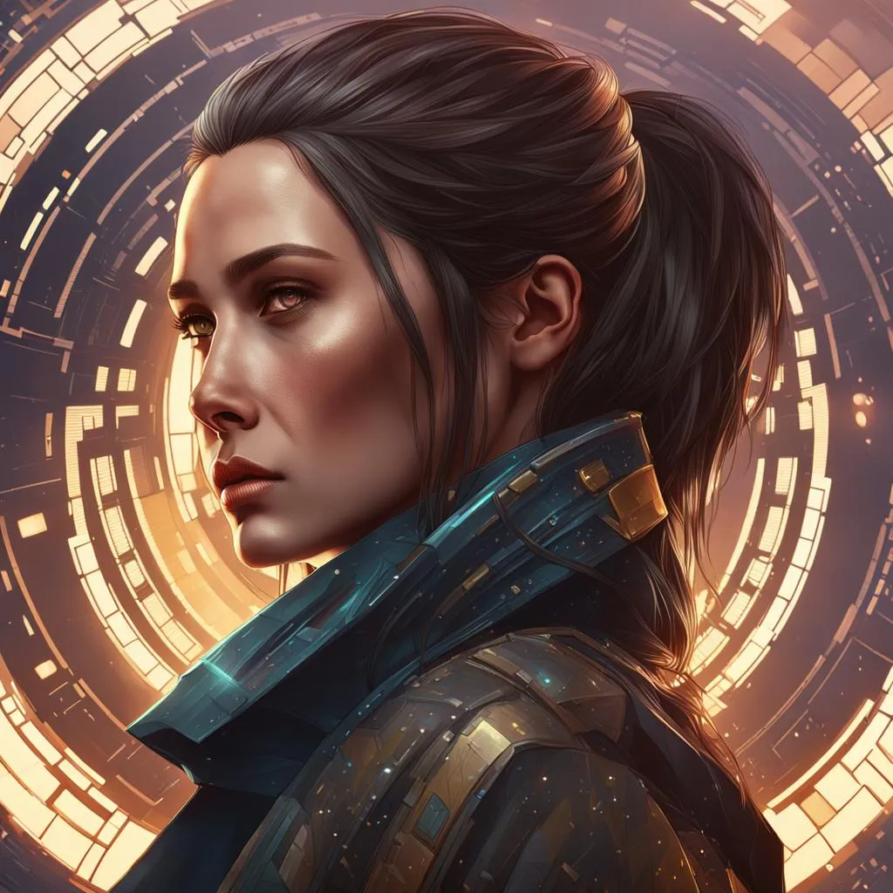
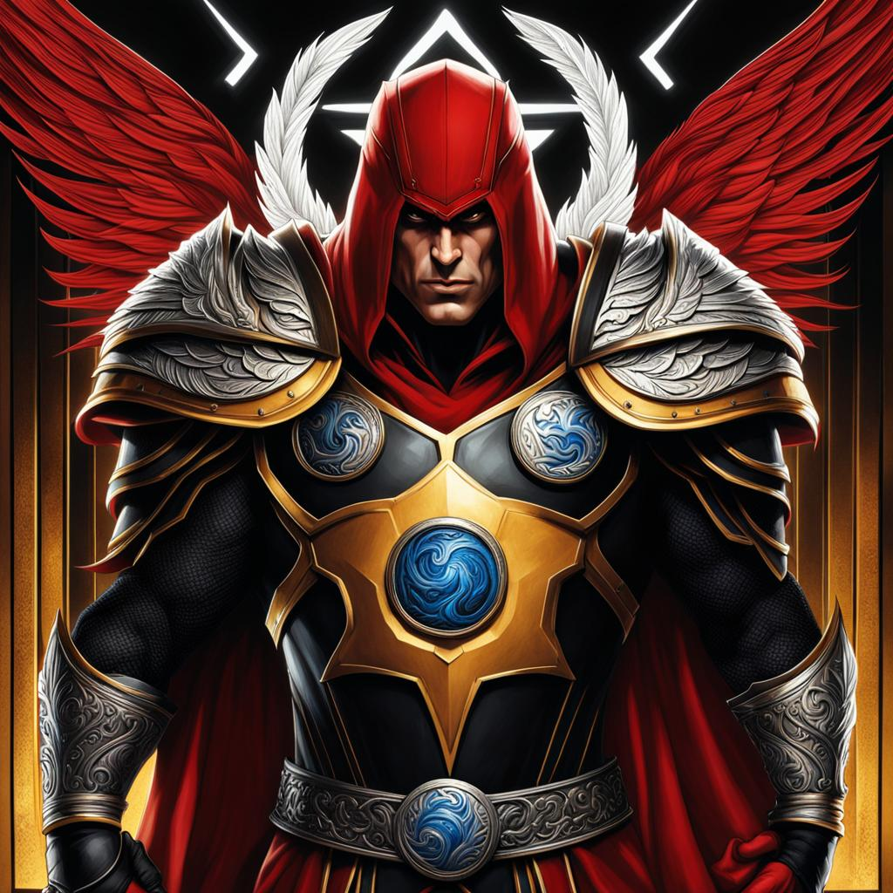
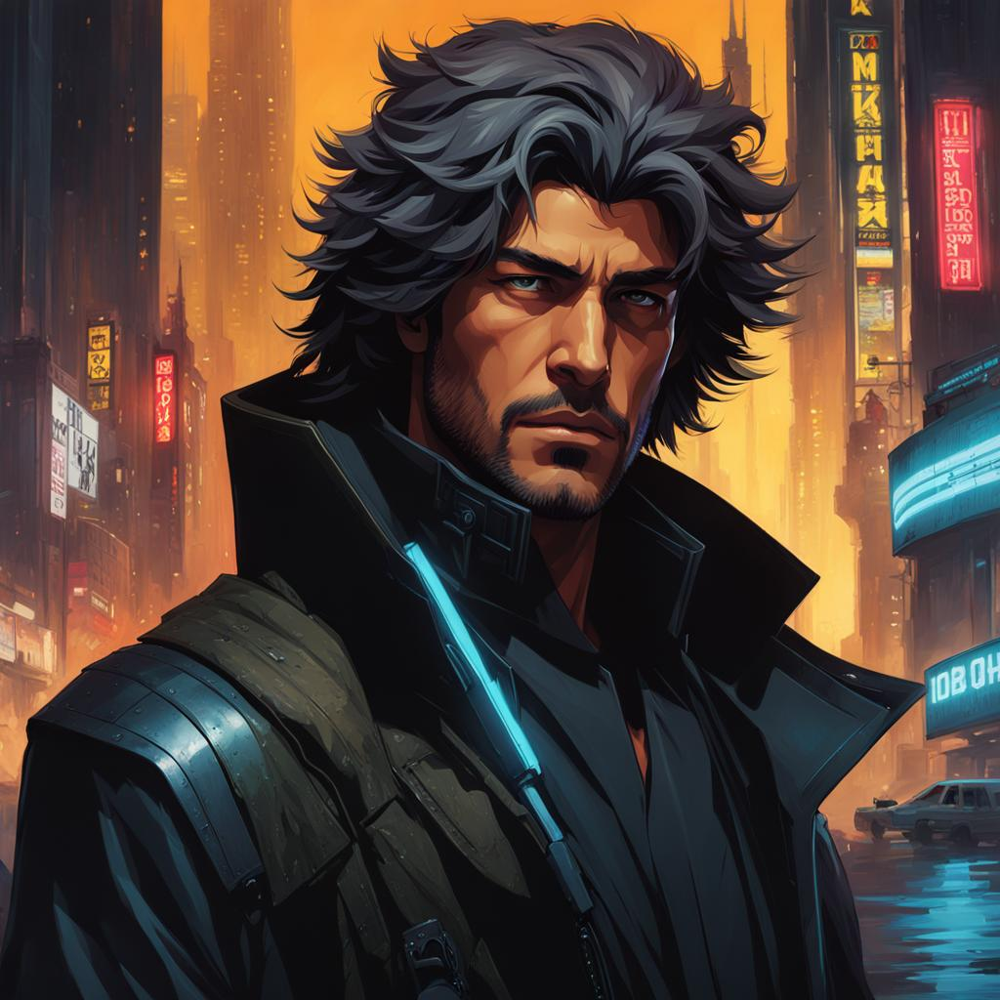
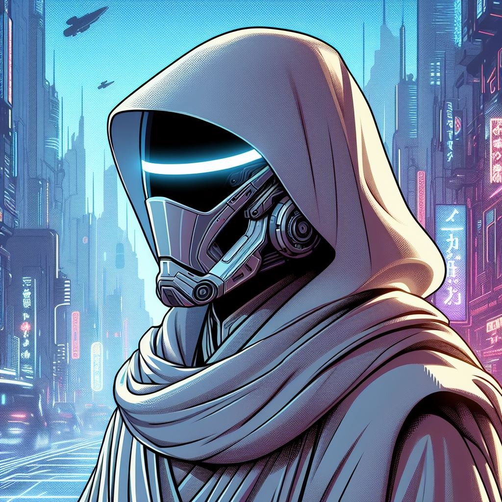
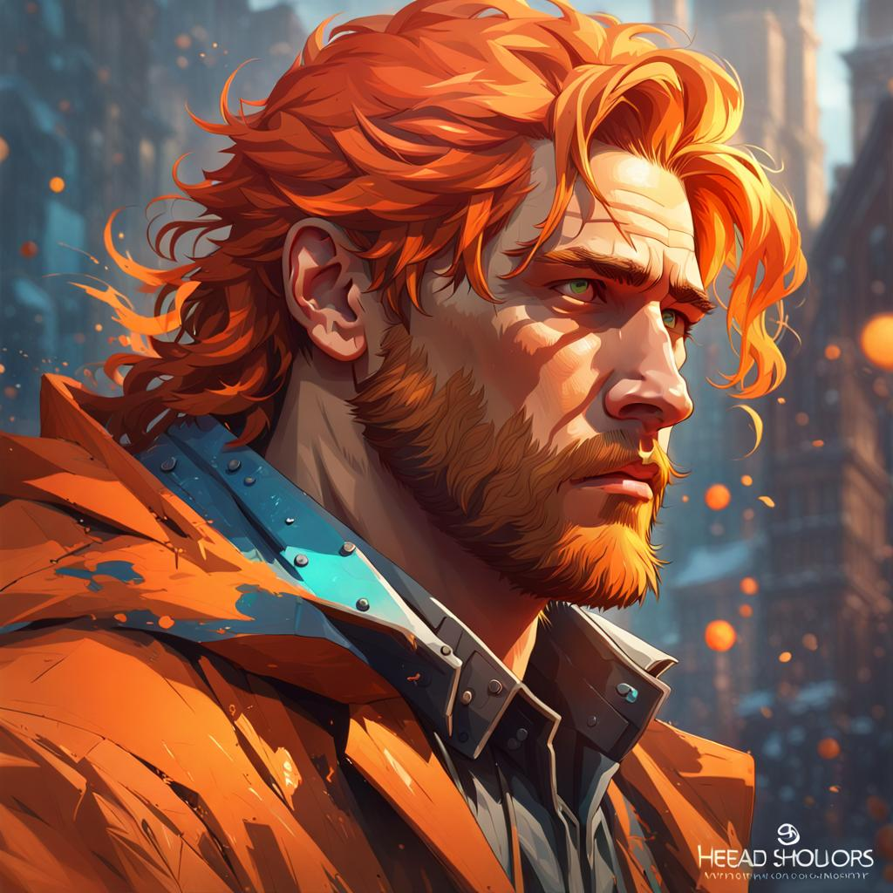
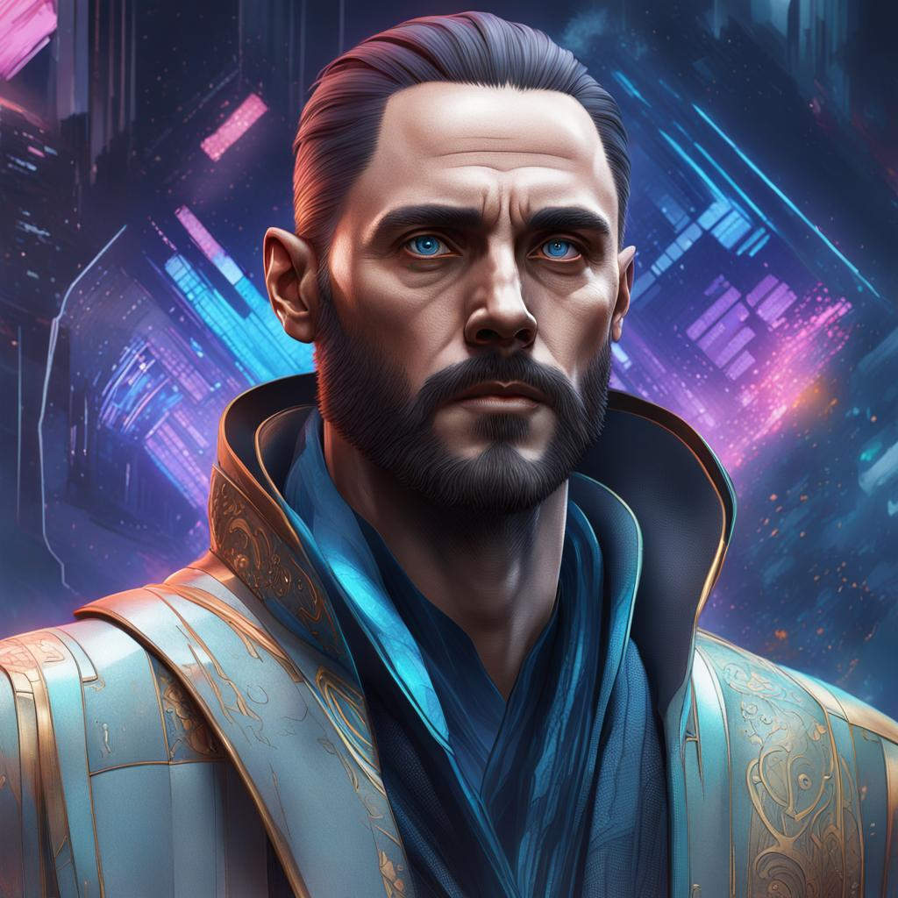

# **Escudo de Órion**

## _**História da facção**_

*No ano 3257, na galáxia de Calamum Caeruleum, a exploração desenfreada do espaço por corporações levou à devastação de muitos planetas e à extinção de várias raças. A situação era caótica e sem lei, com guerras contínuas e conflitos alimentados pela ganância e ambição das corporações.*

*Neste cenário sombrio, o Comandante Estelar Marsicano, em busca de livrar todos do cenário de destruição, se recordou de uma lenda que desde sua infância seu pai lhe contava antes de dormir.*

*Seu pai começava da seguinte forma:*

**_"Numa noite estrelada, em meio ao vasto cosmos da galáxia de Calamum Caeruleum, uma lenda antiga ecoa entre os povos que clamam por justiça e proteção. É a lenda dos Guardiões, cujo nome evoca o poder e a proteção da constelação de Órion, que brilha majestosamente nos céus._**

**_Em tempos imemoriais, quando a Calamum Caeruleum era apenas um berço de estrelas, Órion brilhava nos céus, não apenas uma constelação, mas como um reino celestial governado pelos Guardiões. Esse reino era governado por um povo sábio e nobre, cujo os objetivos eram proteger os fracos, defender os oprimidos, se mantendo sempre guerreiros da luz prezando pela paz e harmonia de todo o universo conhecido e desconhecido._**

**_Contudo, a serenidade de Órion foi ameaçada com o surgimento das sombras do cosmos,  uma força maligna conhecida como Escuridão Primordial. Tal entidade lançou seu olhar cobiçoso sobre Órion, desejando extinguir toda sua luz e subjugar seus habitantes. Os Guardiões, percebendo a magnitude da ameaça, ergueram-se para enfrentar a Escuridão com bravura e determinação, convocando os bravos de coração a se juntarem à sua causa._**

**_Com a chegada da batalha épica entre a luz e a escuridão, os Guardiões perceberam que não poderiam vencer sem uma forte liderança. Era necessária uma aliança dos seres mais corajosos de toda a galáxia e dispostos a se unir em prol de um bem maior. Foi assim que ergueram o chamado Escudo de Órion que lideraram todos para a luz e trariam os Guardiões de volta para seu tempo de glória._**

**_Apesar dos desafios e sacrifícios, nunca vacilaram em sua missão. Foram diversas batalhas travadas e, a um passo de cada vez, o Escudo de Órion foi espalhando a luz de volta para todos.  Com determinação inabalável e coragem indomável, eles perseveraram até que, finalmente, a Escuridão Primordial foi derrotada e banida para as profundezas do universo._**

**_Com a paz restaurada, Órion foi reerguida como um símbolo de esperança e inspiração para todos os povos da galáxia. Eles juraram sempre proteger, defender e manter a luz ardente contra as trevas que tentam dominá-los._**

**_Desde então, os Guardiões têm mantido sua vigilância, patrulhando os confins da galáxia em busca de justiça e equilíbrio. Eles são os herdeiros do legado de Órion, os guardiões da luz que brilham nos céus e nos corações daqueles que clamam por proteção._**

**_E assim, a lenda dos Guardiões vive, ecoando através dos séculos como um lembrete de que, mesmo nas noites mais escuras, a luz da esperança nunca se apaga."_**

*A lembrança dessa lenda despertou no Comandante uma chama de esperança, alimentando seu desejo de fazer a diferença e restaurar a ordem na galáxia. Ele compreendeu que precisava de aliados excepcionais, determinados a lutar pela justiça e proteção dos inocentes.*

*Ao se aventurar em busca do Escudo de Órion, o Comandante encontrou uma equipe formidável, liderada por Rígel, uma figura notável entre os Guardiões. Dotada de coragem, sabedoria e compaixão, Rígel emergiu como uma líder extraordinária em tempos de grande adversidade.*

*Junto com seus companheiros, incluindo o destemido Earendel, o corajoso explorador Thane, o estrategista audaz Orionis, o diplomata pacífico Alnilam, o caçador implacável Betelgeuse e o espírito livre Alnitak, o Comandante Marsicano embarcaram em uma missão de justiça para combater as corporações destrutivas e restaurar a paz na galáxia.*

*Cada membro do Escudo de Órion tinha uma história única que os levou a se unir à equipe, contribuindo com suas habilidades e valores para a missão de proteger os inocentes e enfrentar as trevas que ameaçam consumir a galáxia.*

*Ao longo de suas jornadas, estão prontos para enfrentar desafios formidáveis e situações de risco extremo, mas sem nunca vacilar em sua missão. Com determinação inabalável e coragem indomável, lutam até que finalmente a luz da esperança brilhe, novamente, forte sobre a galáxia de Calamum Caeruleum.*

---

# _**Membros da Facção**_

### **Rígel**

Rígel, nascida em uma família modesta no Reino dos Guardiões, demonstrou desde cedo uma natureza excepcional, com uma vontade inabalável de ajudar os outros. 

Sua liderança natural e capacidade de resolver conflitos a tornaram uma figura importante desde a infância. 

Determinada a fazer a diferença na galáxia, Rígel dedicou sua vida à proteção dos inocentes e à luta contra as forças do mal. 

Sua sabedoria, coragem e empatia foram fundamentais para liderar o Escudo de Órion em enfrentar os desafios e ameaças à paz na galáxia. 

Ao longo de sua jornada, ela se destacou como uma líder amada e respeitada por todos que a conheciam.

---

### **Orionis**

Orionis, nascido em um planeta remoto, destacou-se como guerreiro excepcional desde jovem.

Testemunhou injustiças e adversidades, buscando uma causa maior. 

Ao conhecer o lendário Escudo de Órion, uma ordem dedicada à proteção dos oprimidos, viu uma oportunidade de usar suas habilidades para o bem. 

Ingressou no Escudo, onde aprimorou suas habilidades e se tornou uma lenda no campo de batalha. 

Sua coragem incansável o transformou em símbolo de esperança na galáxia, deixando um legado como o Guerreiro Destemido.

---

### **Thane**

Magnus, criado nas ruas de uma megalópole, desenvolveu uma perspicácia aguçada para sobreviver. 

Tornou-se um investigador independente, atraindo clientes poderosos e inimigos perigosos. 

Cruzou o caminho dos Guardiões de Órion em uma investigação e decidiu se juntar a eles, adotando o nome Thane. 

Suas habilidades de investigação se tornaram valiosas para desvendar os planos das corporações corruptas e proteger os fracos. 

Thane é um símbolo de esperança para os oprimidos, mostrando que a justiça pode prosperar mesmo nas circunstâncias mais adversas.

---

### **Earendel**

Earendel, um símbolo de esperança para os oprimidos, surgiu durante um ataque corporativo, protegendo crianças e inspirando confiança. 

Reconhecido por Rígel, foi convidado a se juntar ao Escudo de Órion. Adotou o nome Earendel, ocultando sua identidade para representar a ideia de bondade e empatia. 

Ele se tornou o guardião dos desamparados, lembrando que, mesmo na escuridão, a esperança persiste.

---

### **Betelgeuse**

Betelgeuse, nativo de Ruboria, um planeta marcado por seu solo vermelho e temperaturas baixas, viu sua paz ameaçada por um conflito intergaláctico. 

Ao se unir aos defensores locais, lutou bravamente contra invasores, mas percebeu que precisava de ajuda. 

Partiu em busca de aliados e encontrou o Escudo de Órion, um grupo de guerreiros lendários. 

Aceito entre eles, Betelgeuse agora viaja pela galáxia, enfrentando o mal e protegendo os inocentes, ciente de que seu destino está entrelaçado com o destino da galáxia.

---

### **Alnilam**

Alnilam nasceu em um planeta marcado por tensões políticas entre facções rivais, testemunhando os horrores da guerra desde jovem.

Após perder tudo em um dos ataques, escolheu buscar a paz através do diálogo e negociação. 

Sua habilidade diplomática excepcional o levou a negociar um acordo de paz entre as facções, trazendo prosperidade para seu planeta. 

Reconhecido pela líder do Escudo de Órion, Alnilam foi convidado a se juntar à equipe, trazendo sua visão de paz e justiça para a galáxia.

