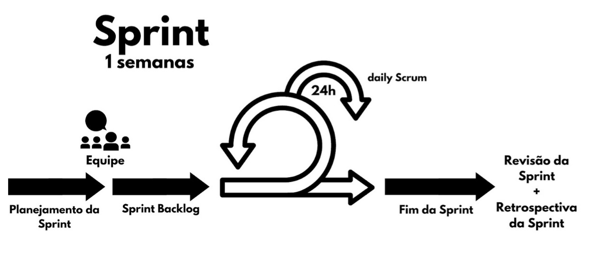

# **Processo de Desenvolvimento de Software**

Com base nas necessidades do projeto, a equipe optou por adotar a metodologia ágil, sendo motivada pela exigência de realizar quatro entregas ao longo do semestre, o que demanda planejamento, avaliação de requisitos, desenvolvimento ágil e ajustes contínuos.

O Scrum XP combina o framework Scrum, que organiza o fluxo de trabalho em sprints, com práticas do Extreme Programming (XP), focadas em técnicas de desenvolvimento de software. Fornece uma estrutura clara, promove colaboração, garante a qualidade do produto, permite flexibilidade e adaptabilidade, e mantém foco constante no cliente.

No ciclo de vida do projeto, as atividades serão realizadas de forma iterativa e incremental, divididas em sprints com duração definida de uma semana. Cada sprint inclui etapas de planejamento, desenvolvimento, revisão e retrospectiva, permitindo a remodelação do projeto com base nos feedbacks.

| Nome da Atividade       | Método                        | Ferramenta          | Entrega                                  |
|-------------------------|-------------------------------|---------------------|------------------------------------------|
| Definição de backlog    | Análise do escopo do projeto | Trello              | Atividades para serem realizadas em cada Sprint. |
| Planejamento da Sprint  | Estimativa de esforço de cada integrante; Seleção dos itens do backlog. | Reuniões de planejamento. | Backlog da Sprint. |
| Revisão de Sprint       | Feedback                      | Reuniões de feedback | Ajustes no backlog                       |
| Daily                   | Comunicação das atividades do dia anterior de trabalho | Mensagens descritivas | Feitos de cada um, junto com dúvidas e outros tópicos importantes para o projeto. |
| Definição do MVP        | Identificação dos recursos essenciais para o produto inicial. | Reunião e definição com o professor. | Lista de recursos prioritários do produto a ser entregue ao final do semestre. |
| User Story              | Funcionalidades do sistema do ponto de vista do usuário | Kanban              | Mapa de história de usuário             |
| Prototipação            | Criação de protótipos para validar ideias e requisitos | Figma               | Protótipos de alta, média e alta fidelidade |
| Modelos de caso de uso | Descrição detalhada dos caso uso | Draw.io             | Diagramas de casos de uso               |
| Desenvolvimento         | Desenvolvimento colaborativo | VsCode, GitHub, GitPage | Incremento de software funcional        |
| Deploy                  | Preparação e implementação do software em ambiente de produção. | Heroku              | Versão do software implantada no ambiente de produção |
