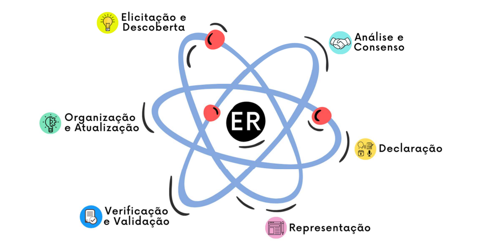

# **Processo de Desenvolvimento de Software**

Com base nas necessidades do projeto, a equipe optou por adotar a metodologia ágil, sendo motivada pela exigência de realizar quatro entregas ao longo do semestre, o que demanda planejamento, avaliação de requisitos, desenvolvimento ágil e ajustes contínuos.

O Scrum XP combina o framework Scrum, que organiza o fluxo de trabalho em sprints, com práticas do Extreme Programming (XP), focadas em técnicas de desenvolvimento de software. Fornece uma estrutura clara, promove colaboração, garante a qualidade do produto, permite flexibilidade e adaptabilidade, e mantém foco constante no cliente.

No ciclo de vida do projeto, as atividades serão realizadas de forma iterativa e incremental, divididas em sprints com duração definida de uma semana. Cada sprint inclui etapas de planejamento, desenvolvimento, revisão e retrospectiva, permitindo a remodelação do projeto com base nos feedbacks.

Segue abaixo a lista das atividades do processo XP combinado com o framework Scrum, apresentadas na tabela a seguir:

| Atividade       | Método                        | Ferramentas         | Entrega                                  |
|-------------------------|-------------------------------|---------------------|------------------------------------------|
| Planejamento da Sprint  | Estimativa de esforço de cada integrante, Seleção dos itens do Backlog | Discord e Kanban | Backlog da Sprint |
| Daily                   | Comunicação das atividades do dia anterior de trabalho | Whatsapp | Atividades de cada membro, junto com dúvidas e demais tópicos importantes para o Projeto |
| Desenvolvimento         | Desenvolvimento colaborativo | VsCode, GitHub, GitPages e Discord | Incremento de valor |
| Revisão de Sprint       | Reuniões de Feedback                                   | Discord | Trabalho concluído durante a Sprint, Feedback e Atualização do Backlog |
<!-- | Definição do MVP   | Identificação dos recursos essenciais para o produto inicial. | Reunião e definição com o professor. | Lista de recursos prioritários do produto a ser entregue ao final do semestre. | -->
<!-- | User Story         | Funcionalidades do sistema do ponto de vista do usuário | Kanban              | Mapa de história de usuário             | -->
<!-- | Prototipação       | Criação de protótipos para validar ideias e requisitos | Figma               | Protótipos de alta, média e alta fidelidade | -->
<!-- | Modelos de Caso de Uso | Descrição detalhada dos Caso Uso | Draw.io             | Diagramas de casos de uso | -->
| Deploy                  | Preparação e implementação do software em ambiente de produção | Heroku              | Versão do software implantada no ambiente de produção |

## **Atividades de Engenharia de Requisitos**
As atividades de engenharia de requisitos são aquelas realizadas no processo de desenvolvimento de software para identificar, analisar, documentar e gerenciar os requisitos do sistema a ser desenvolvido. Esses requisitos representam as necessidades e expectativas dos stakeholders, como clientes, usuários finais e outros envolvidos no projeto. A seguir, detalharemos as atividades de engenharia de requisitos que serão realizadas durante o processo de desenvolvimento:

### **Elicitação e Descoberta**
A atividade de elicitação e descoberta é essencial na fase inicial do projeto. O objetivo é identificar e coletar as necessidades dos stakeholders, incluindo clientes e usuários finais. Assim, compreender suas necessidades e problemas, bem como como o sistema os ajudará, é essencial. Para isso, entrevistaremos os clientes e criaremos uma lista de requisitos de alto nível do sistema.

### **Análise e Consenso**
Após a etapa de elicitação, a análise e o consenso são essenciais para garantir que os requisitos sejam compatíveis. O objetivo é chegar a um consenso entre os stakeholders sobre quais requisitos são essenciais e prioritários para o projeto, identificando possíveis desacordos, conflitos ou lacunas entre eles. Para atingir esse objetivo, a equipe se reunirá para discutir os requisitos coletados e chegar a um consenso com os stakeholders.

### **Declaração**
Nesta fase, os requisitos são comunicados de forma clara e concisa, utilizando linguagem natural. Os requisitos funcionais (RF's) e não funcionais (RNF's) serão apresentados como histórias de usuário, que descrevem de forma simples a funcionalidade desejada. Esses requisitos serão representados por meio de cartões, contendo uma frase que apresenta o papel do usuário, sua atividade, o valor de negócio da atividade e os critérios de aceitação daquele requisito.

### **Representação**
A representação visual dos requisitos é essencial para melhor compreensão. Diagramas, modelos ou protótipos são recursos comumente utilizados para representar os requisitos, permitindo uma visualização mais clara de como serão implementados.
Para criar modelos que possam ser visualizados pelo cliente, a equipe empregará métodos de prototipação. Essa abordagem não apenas permitirá uma melhor compreensão, mas também tornará mais fácil para o cliente fornecer feedback útil durante o processo de desenvolvimento.

### **Verificação e Validação**
A verificação dos requisitos envolve a revisão para assegurar que estejam corretos, consistentes e completos. Este processo envolve testes que visam garantir que o produto final esteja em conformidade com os requisitos estabelecidos.

Por outro lado, a validação verifica se os requisitos realmente atendem às necessidades e expectativas dos stakeholders. Essa etapa garante que o sistema resultante seja aceitável para eles. Para isso, serão realizadas reuniões de validação com os stakeholders, proporcionando um espaço para coletar feedback e sugestões de melhoria.

### **Organização e Atualização**
Essa etapa, que ocorre de forma paralela às demais atividades após a etapa de análise e consenso, concentramo-nos na organização estruturada dos requisitos. Para isso, refinaremos os requisitos com base em seu valor agregado ao produto e os estruturaremos utilizando a hierarquia de MVP, épicos, funcionalidades e histórias de usuário.
Além disso, precisamos garantir garantir que os requisitos estejam sempre atualizados diante de possíveis mudanças nos requisitos ao longo do projeto.

### **Atividades**
A seguir, apresentamos uma tabela detalhando as atividades fundamentais da Engenharia de Requisitos associadas a cada etapa do processo:

| Atividade                        | Método                                            | Ferramentas                             | Partes Envolvidas                       | Entrega                            |
|----------------------------------|---------------------------------------------------|-----------------------------------------|-----------------------------------------|------------------------------------|
| Elicitação e Descoberta          | Entrevistas com os Stakeholders                   | Discord, Google Docs                    | Equipe de Desenvolvimento, Stakeholders | Lista de Requisitos de Alto Nível  |
| Análise e Consenso               | Reuniões e Discussões                             | Discord, Google Docs, Kanban            | Equipe de Desenvolvimento, Stakeholders | Lista de Requisitos Priorizados    |
| Declaração                       | Histórias de Usuário, Cartões de Requisitos e Diagrama de Casos de Uso | Kanban e Draw.io   | Equipe de Desenvolvimento, Stakeholders | Especificação de Requisitos em Histórias de Usuários |
| Representação                    | Prototipagem                                      | Figma                                   | Equipe de Desenvolvimento               | Protótipos de Média e Alta Fidelidade |
| Verificação e Validação          | Revisão e Testes                                  | Django, Checklist                       | Analista de Qualidade, Analista de Testes | Relatórios de Verificação e Validação |
| Organização e Atualização        | Estruturação e Refinamento                        | Kanban                                  | Equipe de Desenvolvimento, Stakeholders | MVP e Lista de Backlog do Produto Atualizada |
