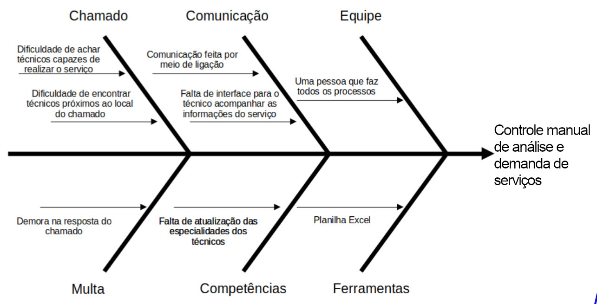

# **Visão Geral do Produto**

## **Problema**

Uma empresa nacional especializada na entrega de soluções de software e hardware mantém um extenso cadastro de técnicos em seu banco de dados, os quais são encarregados de realizar reparos requisitados por seus clientes. Esses serviços frequentemente requerem prazos de execução curtos.

No momento em que um chamado é aberto, a empresa precisa localizar um técnico em sua base de dados e estabelecer contato para averiguar sua disponibilidade para a execução do serviço. No entanto, a empresa enfrenta uma lacuna crítica, pois não dispõe de um sistema ágil para a comunicação com seus técnicos.

Atualmente, todas as operações são conduzidas manualmente através de uma planilha Excel, o que contribui para uma maior burocracia e prolongamento do tempo necessário para o processo. Para entrar em contato com os técnicos, a empresa realiza uma série de chamadas telefônicas até localizar um profissional disponível, resultando em um considerável desperdício de tempo e, por conseguinte, retardando a solução das demandas dos clientes.

Adicionalmente, a empresa é obrigada a cumprir estritamente os prazos de atendimento dos chamados, para evitar repercussões graves, como danos à sua reputação e possíveis penalidades monetárias substanciais.

Por fim, a empresa ainda enfrenta a carência de um sistema para comunicação regular, seja semanal ou mensal, com os técnicos, a fim de verificar continuamente sua disponibilidade e comprometimento com a prestação de serviços. 

Este déficit resulta na necessidade de designar um funcionário para realizar contatos individuais com cada técnico cadastrado na planilha Excel, a fim de confirmar sua viabilidade para novos serviços. Tal processo consome recursos consideráveis, tanto em termos financeiros quanto de tempo.

Todos esses desafios surgem da falta de uma interface que facilite e automatize a troca de informações entre os técnicos e a empresa.

### _Diagrama espinha de peixe_

## **Declaração de Posição do Produto**

O produto se destaca por oferecer uma solução ágil e automatizada para a comunicação e coordenação de técnicos para realizar um determinado serviço, eliminando a necessidade da maior parte dos processos manuais. 

Através de uma interface intuitiva e eficiente, o produto permite localizar rapidamente técnicos disponíveis, estabelecer contato imediato e acompanhar o progresso dos serviços em tempo real. Além disso, oferece funcionalidades de gestão de prazos e notificações para garantir a entrega pontual dos serviços, evitando consequências graves para a empresa, como atrasos nas entregas, danos à reputação e multas elevadas.

O cliente-alvo é uma empresa especializada na entrega e manutenção de soluções de software e hardware que enfrentam desafios na logística de técnicos para o atendimento de chamados abertos pelos clientes da empresa. A empresa busca uma solução tecnológica que simplifique e agilize o processo de comunicação com seus técnicos, permitindo atender às demandas de forma rápida e eficiente.

O produto se diferencia dos concorrentes pela sua abordagem abrangente e integrada para a gestão de técnicos. Enquanto muitas soluções do mercado se concentram apenas em aspectos específicos, como localização de profissionais disponíveis, o nosso produto irá oferecer uma solução completa que abrange desde a busca e contato inicial com os técnicos até o acompanhamento em tempo real do processo dos serviços.

Além disso, o produto se destaca pela sua facilidade de uso e interface intuitiva, que permite uma integração suave com os próprios processos existentes na empresa. Com funcionalidades de gestão de prazos, notificações automáticas e relatórios detalhados dos serviços para ambas as partes do processo, o produto proporciona uma experiência superior aos usuários, ajudando-os a otimizar seus processos operacionais e aprimorar a qualidade de serviço oferecido aos clientes.

## **Objetivos do Produto**

Com base no chamado registrado pelos clientes na Plataforma de ServiceDesk, o sistema realiza a correlação do problema identificado com a base de técnicos, buscando alocar o recurso mais próximo e com a competência necessária para o atendimento. 

Os técnicos são filtrados de acordo com suas competências, localização geográfica, preço do serviço, atividade atual e proximidade do local de serviço, sendo então plotados em um mapa para visualização fácil dos disponíveis na região do chamado. 

Uma vez selecionado o técnico, é disparada uma comunicação para que este atenda ao chamado, enquanto uma interface permite tanto ao técnico quanto à empresa acompanharem o andamento do serviço. 

O sistema tem como objetivo reduzir o tempo de resposta dos chamados, oferecendo também uma interface para a confirmação da coerência do chamado. As competências dos técnicos são constantemente atualizadas, e caso não haja contato com o técnico escolhido inicialmente, o sistema é capaz de acionar automaticamente outro técnico para o atendimento.
